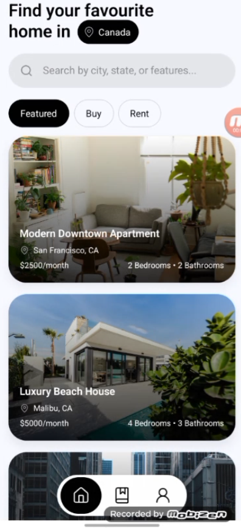
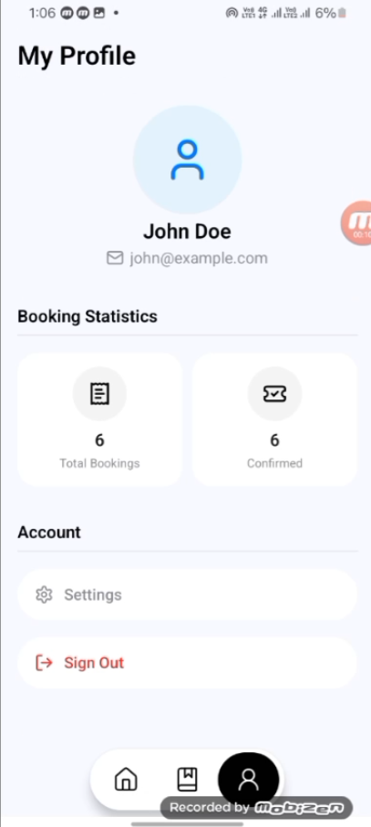

# Property Booking App

A modern mobile application built with React Native and Expo for property booking and management.

## 🚀 Getting Started

### Prerequisites

- Node.js (v16 or higher)
- npm or yarn
- Android Studio (for Android emulator)
- Expo CLI (`npm install -g expo-cli`)

### Installation

1. Clone the repository:
```bash
git clone [your-repository-url]
cd Property-Booking
```

2. Install dependencies:
```bash
npm install
```

3. Start the development server:
```bash
npm run dev
```

4. Start the mock API server (in a separate terminal):
```bash
npm run server
```

### Running on Android Emulator

1. Make sure you have Android Studio installed and an Android Virtual Device (AVD) set up
2. Start your Android emulator from Android Studio
3. In the Expo development server, press 'a' to open the app in the Android emulator
   - Alternatively, you can scan the QR code with the Expo Go app on your physical device

## 📱 Features

- Property listing and search
- Property details view
- Booking management
- User authentication
- Location-based services
- Interactive maps

## 🛠️ Tech Stack

- React Native
- Expo
- TypeScript
- NativeWind (Tailwind CSS for React Native)
- Zustand (State Management)
- React Query
- JSON Server (Mock API)

## 📸 Screenshots and Videos

You can add screenshots and videos of your app here. For example:

```markdown
### App Screenshots



### Demo Video
[](assets/demo_video.mp4)
```

## 🤝 Assumptions

1. The app uses a mock API (JSON Server) for development purposes
2. Android emulator is properly configured with the latest Android SDK
3. User has basic knowledge of React Native and Expo development
4. Internet connection is required for maps and location services
5. Camera and location permissions are required for full functionality

## 📝 Additional Notes

- The app uses Expo Router for navigation
- NativeWind is configured for styling
- The mock API runs on port 3001
- Environment variables should be configured for production deployment

## 🔧 Troubleshooting

If you encounter any issues:

1. Make sure all dependencies are installed correctly
2. Clear the Metro bundler cache: `expo start -c`
3. Ensure the Android emulator is running before starting the app
4. Check if the mock API server is running on port 3001

## 📄 License

This project is licensed under the MIT License - see the LICENSE file for details.

## 👥 Contributing

1. Fork the repository
2. Create your feature branch (`git checkout -b feature/AmazingFeature`)
3. Commit your changes (`git commit -m 'Add some AmazingFeature'`)
4. Push to the branch (`git push origin feature/AmazingFeature`)
5. Open a Pull Request 
